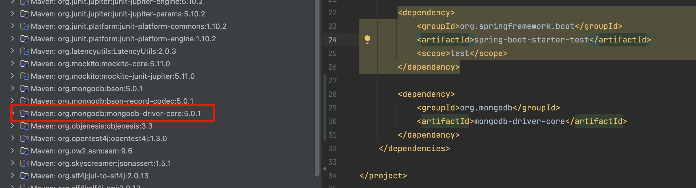

In java spring framework project, I found a tag in most of pom.xml file:
```
    <parent>
		<groupId>org.springframework.boot</groupId>
		<artifactId>spring-boot-starter-parent</artifactId>
		<version>3.3.0</version>
		<relativePath/> <!-- lookup parent from repository -->
	</parent>
```
I checked the source code in this artfact, there are some files:
```
spring-boot-starter-parent-3.3.0.pom              2024-05-23 13:33     13305      
spring-boot-starter-parent-3.3.0.pom.asc          2024-05-23 13:33       833      
spring-boot-starter-parent-3.3.0.pom.md5          2024-05-23 13:33        32      
spring-boot-starter-parent-3.3.0.pom.sha1         2024-05-23 13:33        40    
```
There is no code in this artifact, only pom files. So further, I checked the main pom file:
```
<project xmlns="http://maven.apache.org/POM/4.0.0" xmlns:xsi="http://www.w3.org/2001/XMLSchema-instance" xsi:schemaLocation="http://maven.apache.org/POM/4.0.0 https://maven.apache.org/xsd/maven-4.0.0.xsd">
<modelVersion>4.0.0</modelVersion>
<parent>
<groupId>org.springframework.boot</groupId>
<artifactId>spring-boot-dependencies</artifactId>
<version>3.3.0</version>
</parent>
<artifactId>spring-boot-starter-parent</artifactId>
<packaging>pom</packaging>
<name>spring-boot-starter-parent</name>
<description>Parent pom providing dependency and plugin management for applications built with Maven</description>
...
</project>
```
This artfact is packaging as pom, and it also has a parent tag! It's spring-boot-dependencies.

Furhter, I checked files of spring-boot-dependencies, there are files:
```
spring-boot-dependencies-3.3.0.pom                2024-05-23 13:33    103427      
spring-boot-dependencies-3.3.0.pom.asc            2024-05-23 13:33       833      
spring-boot-dependencies-3.3.0.pom.md5            2024-05-23 13:33        32      
spring-boot-dependencies-3.3.0.pom.sha1           2024-05-23 13:33        40  
```
It also no code, just pom file here! And I checked the pom file again, it's part of file:
```
<project xmlns="http://maven.apache.org/POM/4.0.0" xmlns:xsi="http://www.w3.org/2001/XMLSchema-instance" xsi:schemaLocation="http://maven.apache.org/POM/4.0.0 https://maven.apache.org/xsd/maven-4.0.0.xsd">
<modelVersion>4.0.0</modelVersion>
<groupId>org.springframework.boot</groupId>
<artifactId>spring-boot-dependencies</artifactId>
<version>3.3.0</version>
<packaging>pom</packaging>
<name>spring-boot-dependencies</name>
<description>Spring Boot Dependencies</description>
<url>https://spring.io/projects/spring-boot</url>
<properties>
<activemq.version>6.1.2</activemq.version>
<angus-mail.version>2.0.3</angus-mail.version>
<artemis.version>2.33.0</artemis.version>
<aspectj.version>1.9.22</aspectj.version>
<assertj.version>3.25.3</assertj.version>
<awaitility.version>4.2.1</awaitility.version>
<zipkin-reporter.version>3.4.0</zipkin-reporter.version>
<brave.version>6.0.3</brave.version>
<build-helper-maven-plugin.version>3.5.0</build-helper-maven-plugin.version>
<byte-buddy.version>1.14.16</byte-buddy.version>
<cache2k.version>2.6.1.Final</cache2k.version>
<caffeine.version>3.1.8</caffeine.version>
<cassandra-driver.version>4.18.1</cassandra-driver.version>
<classmate.version>1.7.0</classmate.version>
...
</properties>
<dependencyManagement>
<dependencies>
<dependency>
<groupId>org.apache.activemq</groupId>
<artifactId>activemq-amqp</artifactId>
<version>${activemq.version}</version>
</dependency>
<dependency>
<groupId>org.apache.activemq</groupId>
<artifactId>activemq-blueprint</artifactId>
<version>${activemq.version}</version>
</dependency>
<dependency>
<groupId>org.apache.activemq</groupId>
<artifactId>activemq-broker</artifactId>
<version>${activemq.version}</version>
</dependency>
<dependency>
<groupId>org.apache.activemq</groupId>
<artifactId>activemq-client</artifactId>
<version>${activemq.version}</version>
</dependency>
...
<dependencies>
</dependencyManagement>
...
</project>
```
You can see this pom file listed many jars and their versions!

Now I understand what does spring-boot-starter-parent do: It provides a pre-defined jar list, specially lists the version of these jars. 

If developer don't know to chose version of jar, they can use this parent tag, it will chose the version automatically, it's very convenient, right? Like this:
```
<?xml version="1.0" encoding="UTF-8"?>
<project xmlns="http://maven.apache.org/POM/4.0.0" xmlns:xsi="http://www.w3.org/2001/XMLSchema-instance"
	xsi:schemaLocation="http://maven.apache.org/POM/4.0.0 https://maven.apache.org/xsd/maven-4.0.0.xsd">
	<modelVersion>4.0.0</modelVersion>
	<parent>
		<groupId>org.springframework.boot</groupId>
		<artifactId>spring-boot-starter-parent</artifactId>
		<version>3.3.0</version>
		<relativePath/> <!-- lookup parent from repository -->
	</parent>
	<groupId>com.example</groupId>
	<artifactId>library</artifactId>
	<version>0.0.1-SNAPSHOT</version>
	<name>library</name>
	<description>Demo project for Spring Boot</description>
	<dependencies>
		<dependency>
			<groupId>org.springframework.boot</groupId>
			<artifactId>spring-boot-starter</artifactId>
            // no version tag
		</dependency>

		<dependency>
			<groupId>org.springframework.boot</groupId>
			<artifactId>spring-boot-starter-test</artifactId>
			<scope>test</scope>
            // no version tag
		</dependency>
	</dependencies>

</project>
```
I tested it by adding a mongodb dependeny, with no version:
```
<dependency>
	<groupId>org.mongodb</groupId>
	<artifactId>mongodb-driver-core</artifactId>
</dependency>
 ``` 
 Reload maven, it downloaded version: 5.0.1
 
And the version in spring-boot-dependencies pom is:
```
<mongodb.version>5.0.1</mongodb.version>
```
Bingo!


